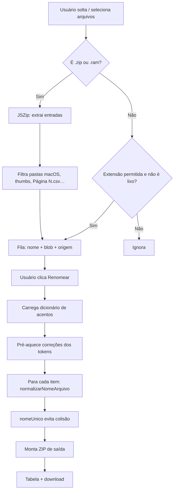

# Tratamento de nomes (renomeação)

Ferramenta da página [`tratamento.html`](../tratamento.html) que normaliza nomes de documentos (Title Case, acentos, siglas, preposições, remoção de lixo) e devolve um ZIP com os arquivos renomeados. O conteúdo dos arquivos **não é alterado** — só o nome.

## Arquivos envolvidos

| Arquivo | Papel |
|---------|--------|
| `tratamento.html` | Página / UI |
| `assets/js/renomeacao/ui.js` | Entrada de arquivos, fila, progresso, ZIP de saída |
| `assets/js/renomeacao/motor.js` | Pipeline de normalização (`normalizarNomeArquivo`) |
| `assets/js/renomeacao/dados.js` | Léxico, siglas, preposições, regex de lixo |
| `assets/data/acentos-pt.json(.gz)` | Dicionário PT (fold → forma acentuada) |
| `scripts/build-acentos-pt.js` | Regenera o dicionário a partir de `dictionary-pt` |

Ordem de carga no HTML: `dados.js` → `motor.js` → `ui.js` (e JSZip via CDN).

## Como usar

1. Abrir `tratamento.html` (ex.: `npm start` → `http://localhost:5500/tratamento.html`).
2. Arrastar/selecionar arquivos soltos ou um `.zip` / `.ram`.
3. Clicar em **Renomear**.
4. Baixar `arquivos_renomeados.zip` e conferir a tabela original → novo nome.

### Extensões aceitas

- **Entrada em lote:** `.zip`, `.ram`
- **Documentos:** `.pdf`, Office (`.doc`, `.docx`, `.xls`, `.xlsx`, …), imagens, `.txt`, `.csv`, etc.  
  Lista completa: `EXTENSOES_PERMITIDAS` em `dados.js`.

---

## Fluxo geral (do arquivo à saída)

### 1. Entrada (`ui.js` → `adicionarArquivos` / `lerArquivoComoItem`)

1. Dropzone ou `<input type="file">` dispara `adicionarArquivos`.
2. Para cada `File`:
   - **ZIP/RAM:** abre com JSZip, ignora diretórios e caminhos em `ignorarCaminho` (`__MACOSX`, arquivos ocultos, `thumbs.db`, nomes tipo “Página 1.csv”). Mantém só extensões permitidas. Cada entrada vira `{ nome, blob, origem }`.
   - **Arquivo solto:** mesma validação de extensão / lixo; entra na fila com `origem` vazia.
3. A fila é renderizada no painel “Arquivos selecionados”.

### 2. Renomear (`ui.js` → `renomear`)

1. `garantirDicionarioAcentos()` — fetch de `acentos-pt.json.gz` (ou `.json`).
2. Extrai tokens de todos os stems e chama `preaquecerCorrecoes` (cache).
3. Para cada item da fila:
   - `novoNome = normalizarNomeArquivo(item.nome)`
   - `caminho = nomeUnico(novoNome, usados)` — se já existir, vira `Nome (2).ext`
   - Copia bytes do blob para o ZIP de saída com o novo caminho
4. Gera o blob ZIP, cria URL de download e preenche a tabela de resultados.

> A pasta interna do ZIP de origem **não é recriada** na UI atual: os arquivos saem “achatados” no ZIP final (só o nome do arquivo). A API legada `processarArquivoTratamento` em `motor.js` preserva pasta relativa.

---

## Pipeline de um nome (`normalizarNomeArquivo`)

Entrada: nome completo (`Contrato_PRECO_assinado.pdf`).  
Saída: stem normalizado + extensão em minúsculas (`Contrato Preço.pdf`).

```mermaid
flowchart LR
    A[Limpar invisíveis / NFKC] --> B[Separar stem e extensão]
    B --> C[Remover sufixo de lixo no stem]
    C --> D[tokensDoStem]
    D --> E[Filtrar tokens lixo]
    E --> F[Remover duplicatas consecutivas]
    F --> G[Remover números de ordenação no início]
    G --> H[capitalizarPalavra por token]
    H --> I[aplicarRegrasTitulo]
    I --> J[Juntar + sanitizar caracteres inválidos]
    J --> K[stem + extensão]
```

### Etapas

| Etapa | Função | O que faz |
|-------|--------|-----------|
| Limpeza Unicode | `limparInvisiveis` | NFKC, aspas tipográficas → ASCII, preserva `º`/`ª` |
| Stem / extensão | — | Extensão → minúscula; processa só o stem |
| Sufixo lixo | `SUFIXO_LIXO_FINAL_RX` | Remove `assinado`, `v2`, `(1)`, etc. no fim |
| Tokenização | `tokensDoStem` | `_`/hífen/ponto → espaço; CamelCase; separa letra/número; protege `001-2025`, `14.3`, `1º`; funde `n`+`12` → `Nº 12` |
| Lixo | `tokenEhLixo` | Remove tokens tipo `assinado`, `final`, `v3`, `(2)` |
| Dedup | `removerDuplicatasConsecutivas` | `Ata Ata` → `Ata` |
| Prefixo numérico | `removerNumerosIniciais` | `01 Portaria…` → `Portaria…` (não remove anos) |
| Capitalização | `capitalizarPalavra` | Ver abaixo |
| Título | `aplicarRegrasTitulo` | Locuções (“através de”) e conectivos no meio |
| Sanitização | — | Remove `<>:"/\|?*`, limita stem a 180 chars |

### Como cada palavra é capitalizada

Ordem em `capitalizarPalavra` / `resolverFormaCanonica`:

1. **“DE” como sigla administrativa** (`isSiglaDE`) — ex.: `DE FISCAL` permanece `DE`, não vira `de`.
2. **Conectivo no meio do título** → minúscula (`de`, `da`, `com`…).
3. **Forma canônica** (nesta ordem):
   - cache
   - `LEXICO_PT` (domínio administrativo / licitação)
   - `CORRECAO_RAPIDA`
   - dicionário `acentos-pt` (Title Case da forma acentuada)
4. **Sigla** → maiúsculas (`TCE`, `CNPJ`).
5. **Romano** → maiúsculas (`III`, `IV`).
6. **Número / código** → preserva; normaliza `nº` → `Nº`.
7. **Fallback** → Title Case simples (`Contrato`).

---

## Exemplos

| Original | Resultado típico |
|----------|------------------|
| `01_contrato_preco_assinado.pdf` | `Contrato Preço.pdf` |
| `ATA-REGISTRO-PRECOS.PDF` | `Ata de Registro de Preços.pdf`* |
| `DE_FISCAL_contrato.docx` | `DE Fiscal Contrato.docx` |
| `n 001 2025 portaria.pdf` | `Nº 001-2025 Portaria.pdf` |
| `Lei14231.pdf` | `Lei 14231.pdf` |

\* Depende do léxico/dicionário para `precos` → `Preços` e das regras de conectivos.

---

## Dicionário de acentos

- Gerado com `npm run build:acentos` (`scripts/build-acentos-pt.js`).
- Fonte: pacote npm `dictionary-pt`.
- Formato: mapa `palavraSemAcento` → `palavraComAcento` (só entradas unívocas).
- Em runtime: preferência por `.json.gz` via `DecompressionStream`; fallback para `.json`.
- Se o fetch falhar, o motor segue só com léxico local + Title Case (aviso no console).

---

## Colisões de nome

`nomeUnico` compara caminhos **sem diferenciar maiúsculas/minúsculas**. Se dois arquivos normalizam para o mesmo nome:

- primeiro: `Contrato.pdf`
- segundo: `Contrato (2).pdf`
- terceiro: `Contrato (3).pdf`

---

## API auxiliar (ZIP legado)

`processarArquivoTratamento(file, opcoes)` em `motor.js` processa um ZIP de uma vez, **preserva pastas relativas** e retorna `{ alteracoes, blob, totalRenomeados, … }`. A página atual usa o fluxo da fila em `ui.js`; esta função fica disponível para outros integradores.

---

## Manutenção rápida

- Novas palavras do domínio → `LEXICO_PT` ou `CORRECAO_RAPIDA` em `dados.js`.
- Novas siglas → `SIGLAS`.
- Complementos de “DE” administrativo → `DE_SIGLA_SEGUINTES`.
- Regenerar acentos PT → `npm run build:acentos` (requer `npm install`).
