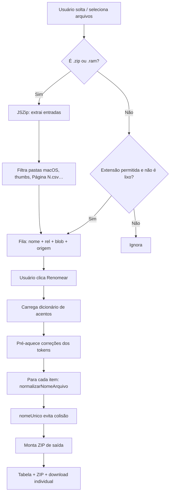

# Tratamento de nomes (renomeação)

Ferramenta da página [`tratamento.html`](../tratamento.html) que normaliza nomes de documentos (Title Case, acentos, siglas, preposições, remoção de lixo) e devolve um ZIP com os arquivos renomeados. O conteúdo dos arquivos **não é alterado** — só o nome.

Há também um **modo texto livre** na mesma página (Title Case + acentos em frases, sem regras de lixo de arquivo).

## Arquivos envolvidos

| Arquivo | Papel |
|---------|--------|
| `tratamento.html` | Página / UI |
| `assets/js/renomeacao/ui.js` | Entrada de arquivos, fila, progresso, ZIP de saída |
| `assets/js/renomeacao/motor.js` | Pipeline de normalização (`normalizarNomeArquivo`) |
| `assets/js/renomeacao/dados.js` | Léxico, siglas, preposições, regex de lixo |
| `assets/data/acentos-pt.json(.gz)` | Dicionário PT (fold → forma acentuada) |
| `scripts/build-acentos-pt.js` | Regenera o dicionário a partir de `dictionary-pt` |
| `scripts/test-tratamento-nomes.js` | Testes (`npm run test:nomes`) |

Ordem de carga no HTML: `dados.js` → `motor.js` → `ui.js` (e JSZip via CDN).

## Como usar

1. Abrir `tratamento.html` (ex.: `npm start` → `http://localhost:5500/tratamento.html`).
2. **Arquivos:** arrastar/selecionar arquivos soltos, uma pasta (sem ZIP) ou um `.zip` / `.ram`.
3. Opcional: excluir itens da fila (soft-delete) antes de processar.
4. Clicar em **Renomear**.
5. Baixar `arquivos_renomeados.zip` e/ou arquivos individuais na tabela.

### Extensões aceitas

- **Entrada em lote:** `.zip`, `.ram`
- **Documentos:** `.pdf`, Office (`.doc`, `.docx`, `.xls`, `.xlsx`, …), imagens, `.txt`, `.csv`, etc.  
  Lista completa: `EXTENSOES_PERMITIDAS` em `dados.js`.

### Drop de vários arquivos

No Chrome/Edge, `webkitGetAsEntry()` de todos os itens do `DataTransfer` é obtido **sincronamente** antes de qualquer `await` (senão só o 1º arquivo entra). Pastas usam a File System Entry API; fallback em `dataTransfer.files`.

---

## Fluxo geral (do arquivo à saída)

### 1. Entrada (`ui.js` → `adicionarArquivos` / `lerArquivoComoItem`)

1. Dropzone ou `<input type="file">` (ou pasta via `webkitdirectory`) dispara `adicionarArquivos`.
2. Para cada `File`:
   - **ZIP/RAM:** abre com JSZip, ignora diretórios e caminhos em `ignorarCaminho` (`__MACOSX`, arquivos ocultos, `thumbs.db`, nomes tipo “Página 1.csv”). Mantém só extensões permitidas. Cada entrada vira `{ nome, rel, blob, origem }` (`rel` = caminho relativo no ZIP).
   - **Arquivo solto / pasta:** mesma validação; entra na fila com `rel` relativo quando houver.
3. A fila permite excluir/restaurar itens sem remover o blob da memória até **Limpar**.

### 2. Renomear (`ui.js` → `renomear`)

1. `garantirDicionarioAcentos()` — fetch de `acentos-pt.json.gz` (ou `.json`). Se falhar, banner: acentos limitados ao léxico local.
2. Extrai tokens de todos os stems e chama `preaquecerCorrecoes` (cache).
3. Para cada item ativo da fila:
   - `novoNome = normalizarNomeArquivo(item.nome)`
   - Mantém a pasta relativa de `item.rel` e aplica `nomeUnico(pasta + novoNome, usados)`
   - Copia bytes do blob para o ZIP de saída com o novo caminho
4. Gera o ZIP e preenche a tabela (com download individual).

> A estrutura de pastas relativa é **preservada** no ZIP final: só o nome do arquivo é normalizado. Pastas em si não são renomeadas na UI.

---

## Pipeline de um nome (`normalizarNomeArquivo`)

Entrada: nome completo (`Contrato_PRECO_assinado.pdf`).  
Saída: stem normalizado + extensão em minúsculas (`Contrato Preço.pdf`).

```mermaid
flowchart LR
    A[Limpar invisíveis / NFKC] --> B[Separar stem e extensão]
    B --> C[Remover sufixo de lixo no stem]
    C --> D[tokensDoStem]
    D --> E[Filtrar tokens lixo]
    E --> F[Remover duplicatas consecutivas]
    F --> G[Remover números de ordenação no início]
    G --> H[capitalizarPalavra por token]
    H --> I[aplicarRegrasTitulo]
    I --> J[Juntar + sanitizar caracteres inválidos]
    J --> K[stem + extensão]
```

Se a string contiver `/` ou `\`, a função delega a `normalizarCaminho` (evita colapsar o caminho na sanitização).

### Como cada palavra é capitalizada

1. **“DE” como sigla administrativa** (`isSiglaDE`) — ex.: `DE FISCAL` permanece `DE`. Em nomes 100% MAIÚSCULOS, só conta sigla conhecida (`SIGLAS`) ou complemento em `DE_SIGLA_SEGUINTES` (não qualquer palavra curta).
2. **Conectivo no meio do título** → minúscula (`de`, `da`, `com`…). Exceção: `segundo`/`segunda` + tipo documental (`aditivo`, `termo`…) → ordinal (`Segundo Aditivo`).
3. **Forma canônica:** cache → `LEXICO_PT` → `CORRECAO_RAPIDA` → dicionário `acentos-pt`.
4. **Sigla** → maiúsculas (`TCE`, `CNPJ`). O set `SIGLAS` evita palavras comuns (`fonte`, `bolsa`, …).
5. **Romano / número / código** → preserva; normaliza `nº` → `Nº`.
6. **Fallback** → Title Case simples.

O motor **não insere** conectivos que não existiam no nome original (`ATA-REGISTRO-PRECOS` → `Ata Registro Preços`, não `Ata de Registro de Preços`).

---

## Exemplos

| Original | Resultado típico |
|----------|------------------|
| `01_contrato_preco_assinado.pdf` | `Contrato Preço.pdf` |
| `ATA-REGISTRO-PRECOS.PDF` | `Ata Registro Preços.pdf` |
| `ATA_DE_PRECO.pdf` | `Ata de Preço.pdf` |
| `DE_FISCAL_contrato.docx` | `DE Fiscal Contrato.docx` |
| `fonte_recurso.pdf` | `Fonte Recurso.pdf` |
| `PORTARIA_SEGUNDO_ADITIVO.pdf` | `Portaria Segundo Aditivo.pdf` |
| `n 001 2025 portaria.pdf` | `Nº 001-2025 Portaria.pdf` |
| `Lei14231.pdf` | `Lei 14231.pdf` |

---

## Modo texto livre

Na mesma página, aba/painel de texto:

- Normaliza frases (Ctrl+Enter, botão ou após colar).
- Não remove lixo de arquivo; preserva CNPJ/CPF, Município-UF, aspas e inícios de frase.
- Em texto, CAPS curtas e `DE` administrativo **não** forçam sigla como em nomes de arquivo.

---

## Dicionário de acentos

- Gerado com `npm run build:acentos` (`scripts/build-acentos-pt.js`).
- Fonte: pacote npm `dictionary-pt`.
- Formato: mapa `palavraSemAcento` → `palavraComAcento` (só entradas unívocas).
- Em runtime: preferência por `.json.gz` via `DecompressionStream`; fallback para `.json`.
- Se o fetch falhar, o motor segue só com léxico local + Title Case; a UI mostra aviso (`dicionarioAcentosDisponivel()`).

---

## Colisões de nome

`nomeUnico` compara caminhos **sem diferenciar maiúsculas/minúsculas**. Se dois arquivos normalizam para o mesmo nome:

- primeiro: `Contrato.pdf`
- segundo: `Contrato (2).pdf`
- terceiro: `Contrato (3).pdf`

---

## Saídas auxiliares

- **Download individual:** ícone na tabela (mesmo blob, `download=` com o nome novo).

## API auxiliar (ZIP legado)

`processarArquivoTratamento(file, opcoes)` em `motor.js` processa um ZIP de uma vez, **preserva pastas relativas** e retorna `{ alteracoes, blob, totalRenomeados, … }`. Disponível para outros integradores.

---

## Manutenção rápida

- Novas palavras do domínio → `LEXICO_PT` ou `CORRECAO_RAPIDA` em `dados.js`.
- Novas siglas → `SIGLAS` (só abreviações reais; não palavras comuns).
- Complementos de “DE” administrativo → `DE_SIGLA_SEGUINTES`.
- Regenerar acentos PT → `npm run build:acentos` (requer `npm install`).
- Regressões → `npm run test:nomes`.
